<!--
Marp version of slides.html (same content). In VS Code: install the "Marp for VS Code" extension, open this file,
click the preview icon; export to PowerPoint/PDF with "Marp: Export Slide Deck". Videos are links (Marp cannot embed
them); slides.html plays them in place.
-->

# Well-plate stacking in Isaac Lab

### From "the robot cannot lift a plate" to three plates stacked, centred, all loose

Weekly meeting · 2026-09-28 · Dewei Wang · Legion laptop (RTX 5090)

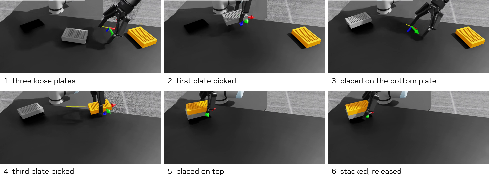

Martin's Ridgeback + UR7e + Robotiq 2F-140 · Martin's WellPlates.usd · PPO (rsl_rl), 512 parallel envs

---

## Three results, each measured on 128 deterministic episodes

| | Result | Was |
|---|---|---|
| **Lift** | **87.5 %** | 0 % on 09-21 — the blocker was our gripper setup |
| **Centred 2-plate stack** (≤ 5 mm, ≤ 3° twist, ≤ 3° tilt, released) | **90.6 %** | 09-26 policy at those criteria: 0 % |
| **Three plates** — all loose, loose bottom plate, realistic arm | **54.7 %** | — |
| 2-plate stack (3 cm tolerance) | 50.8 % | 0 % |
| Other libraries, from scratch | Reach: all GPU PPOs 100 %; Align: only skrl PPO (98.4 %) | — |

Deterministic = the policy's mean action, no exploration noise. Training-log success is noisier and lower (slide 14).

---

## What happened this round

| Date | Step | Outcome |
|---|---|---|
| 09-21 | Status meeting: reach 97 %, align 96 %, lift 0 % | blocked |
| 09-22 – 25 | Martin's GRIPPERFIX checked (does not compose with our robot); message to Martin | no reply; went on alone |
| 09-26 | Four defects in *our* gripper setup fixed; grasp gate 16/16; ladder align → lift → stack | lift 87.5 %, stack 50.8 % |
| 09-26/27 | Centred stacking: twist observation, tolerance curriculum, release incentive | 90.6 % |
| 09-27 | Three plates (hand-off, all loose), loose bottom plate, realistic arm | 52 / 46 / 49 / 55 % |
| 09-27/28 | skrl, rl_games, Stable-Baselines3 on the same tasks | comparison |

Unattended runs: scripts gate each stage on a deterministic evaluation, retry once, stop for diagnosis. Every decision: PROGRESS.md.

---

## The lift blocker was our gripper setup — four defects

- **Pad joint driven to 0** (copied from the URDF); in the USD it closes the four-bar loop and must follow +q → pads bent into a V.
- **Grasp height** — pads travel 18 mm toward the table while closing; they hit it.
- **Closing axis** — across the 128 mm side, not the 85 mm side.
- **Contact physics** — pads sank through the plate under a squeeze; Isaac Lab's own 2F-140 settings fixed it.

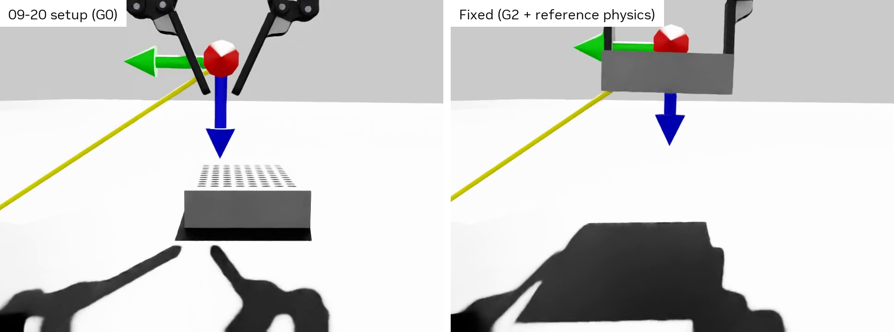

[▶ V2 grasp: 09-20 setup vs fixed](videos/V2_grasp_G0_vs_fixed.mp4)

---

## Grasp verified: 16 / 16 held, lifted 10 cm, 0.6° tilt

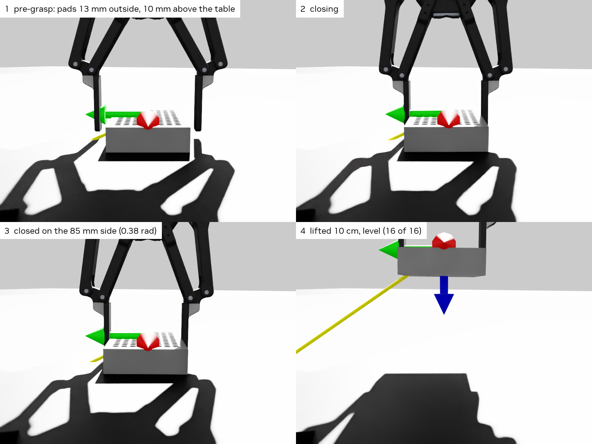

Scripted controller, before any training — the gate for the ladder. Pad travel 18.4 mm measured vs 18.3 mm predicted from the USD.

---

## Align → lift → stack works once the grasp works

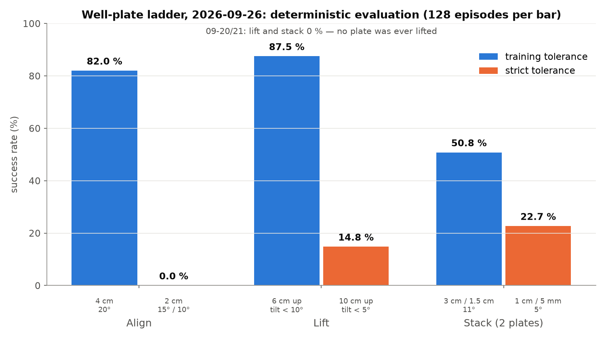

[▶ V3 lift before/after](videos/V3_lift_before_after_viewA.mp4) · [▶ V4 stack, 8 episodes](videos/V4_stack_8_episodes_labelled.mp4)

Gate on deterministic eval (noise flips a binary gripper) · entropy 0.01 → 0.001 · stack rewards that do not switch off at the goal · gripper exploration so it learns to let go.

---

## Centred, aligned, level: 90.6 % (the 09-26 policy: 0 %)

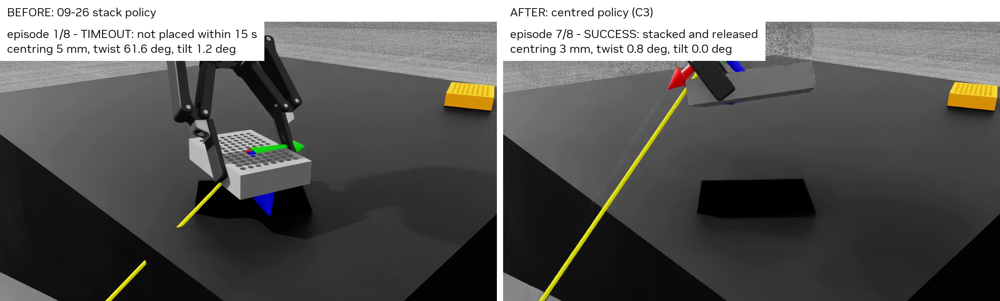 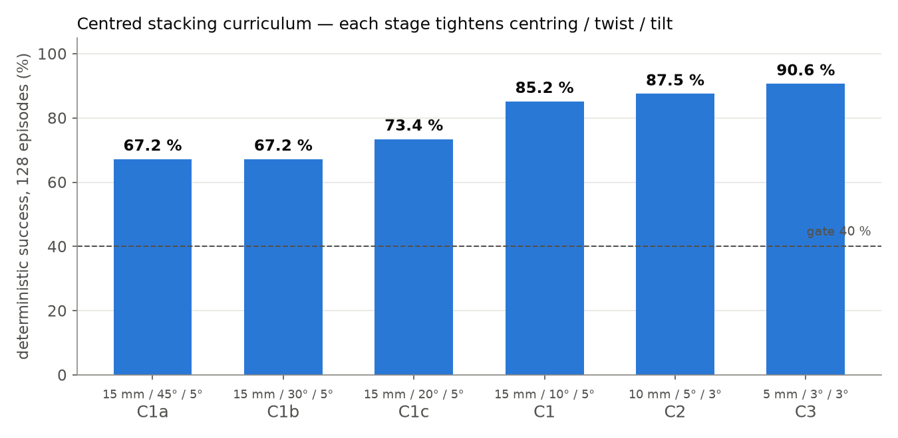

| Centring ≤ 5 mm | Twist ≤ 3° | Tilt ≤ 3° | Released |
|---|---|---|---|
| median **2.4 mm** | **0.9°** | **0.0°** | yes |

[▶ V5 before vs after, 8 episodes each](videos/V5_centred_before_vs_after.mp4)

---

## Three findings that made centring learnable

1. **Tell the policy which way to turn** — twist as an observation (sin 2Δ, cos 2Δ), instead of decoding two quaternions and a 49° mesh offset.
2. **Raise the bar in steps** — twist 45° → 30° → 20° → 10° → 5° → 3°, centring 15 → 5 mm. At 10° straight away nothing was ever rewarded.
3. **Make letting go worth it** — success ends the episode with the value bootstrapped, so the one-off bonus is the only gain from releasing; rewards scale with the 1/30 s step, so a bonus of 50 paid 1.7 (below the critic's noise). 600 → C1a 1.6 % → 67 %.

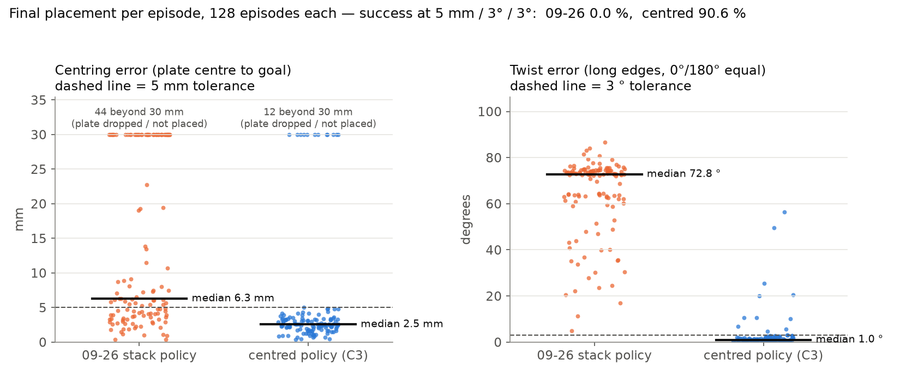

---

## All three of Martin's plates, stacked

[▶ V6 final setting, overview, 6 episodes](videos/V6_three_plates_E4_viewT.mp4) · [▶ V7 close-up](videos/V7_three_plates_E4_viewS.mp4)

The bottom plate renders black in our container although it uses the same mesh as the other two — cause not checked yet.

---

## Every step passed its 40 % gate

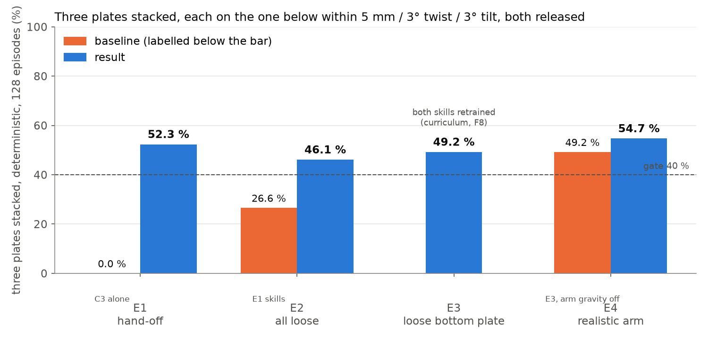

| Step | Setting | Result |
|---|---|---|
| E1 | next plate handed off into the pick area | **52.3 %** |
| E2 | all plates start loose | **46.1 %** |
| E3 | + loose bottom plate (moves ≤ 1 cm) | **49.2 %** |
| E4 | + realistic arm | **54.7 %** |

---

## One policy failed; two skills and two curricula worked

- **One policy for both placements** forgot the first placement (weights overwritten — swap test), then learned not to grasp.
- **Two skills**: C3 places the first plate; a second policy, trained from it, places the third.
- **Rising stack**: at full height directly 0.8 %; a kinematic middle plate rising 0 → 26 mm: 70–92 % per step, 91 % at full height.
- **Hand-off start states**: its first move dragged the placed plate (> 5 mm in 61 % within 0.17 s) — fixed with 2000 recorded hand-offs.
- **Loose bottom plate**: mass curriculum 20 kg → 50 g + a penalty for pushing it.

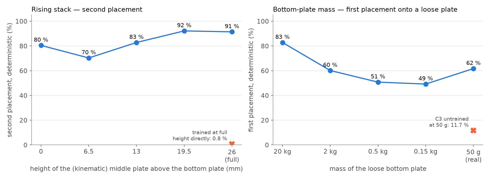

---

## Realistic arm: gravity on, compensated — no retraining

| Arm model | IK tracking error after 300 steps |
|---|---|
| Gravity off (used for training) | 0.0 mm |
| Gravity on, no compensation | **434 mm** |
| Gravity on + compensation G(q) from PhysX, every physics step | 0.0 mm |

The E3 policies on the realistic arm, unchanged: **54.7 %** (49.2 % with gravity off — within sampling noise).

---

## Other libraries — same task, from scratch, one seed each

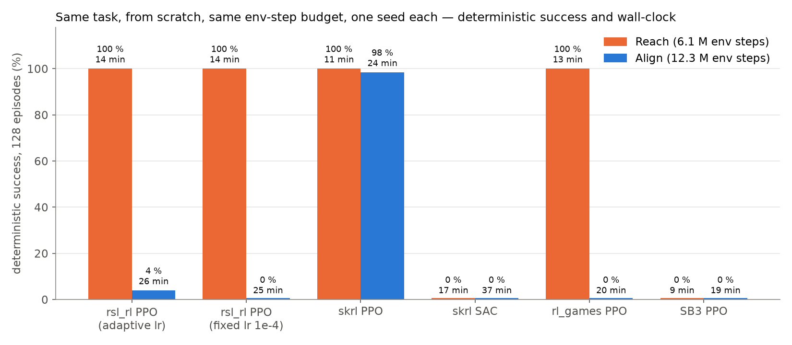

Only skrl PPO learned Align from scratch (98.4 %). Why it beats rsl_rl is open (a learning-rate explanation was tested and rejected; next: value normalisation). SB3 PPO and skrl SAC look under-powered with these settings, not a fair verdict.

---

## Why we report deterministic evaluation, not the training curve

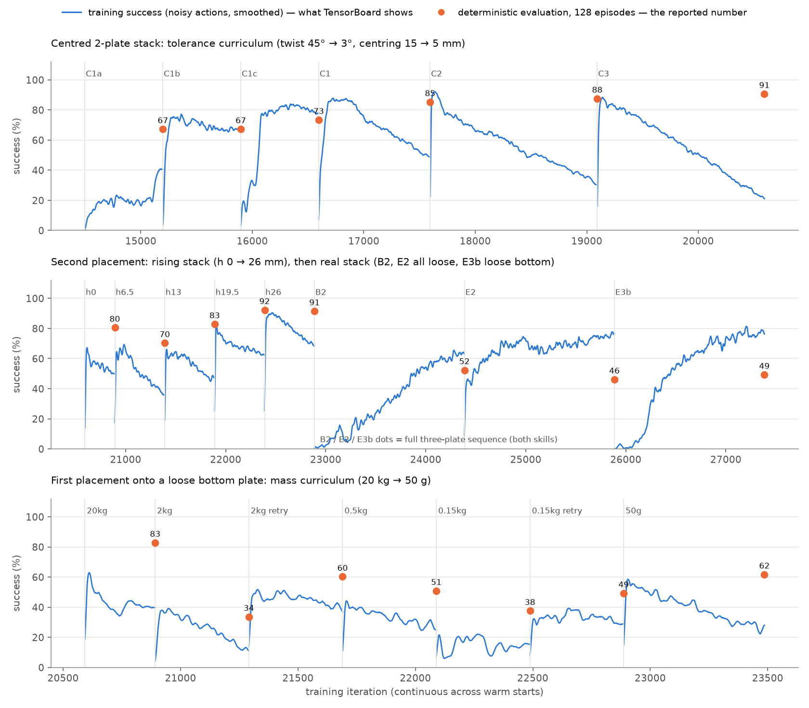

Blue = TensorBoard's training success (with exploration noise). Orange = deterministic evaluation, 128 episodes — every gate and number uses these.

---

## What these numbers do not show yet

- **One seed per training run** — no variance yet.
- **Final setting fails 45 %**: 36 % time-outs, 9 % drops.
- **Two policies** switched by the environment's phase — not one policy that chains both placements.
- **Privileged state** (exact plate poses), no camera; robot base locked; no randomisation of mass / friction / poses.
- Realistic arm = gravity + compensation only.

---

## Next — and what we need from the team

**Could do next:** 3 seeds · cut the time-outs · one chaining policy · domain randomisation · skrl vs rsl_rl (value normalisation) · camera-based plate detection.

**Questions:**
- **Martin** — bottom plate renders black in our container (same mesh as the others) — known? One self-contained robot USD with the working gripper?
- **Alvika** — camera-based plate detection: reuse from TubeRacking?
- **All** — are 5 mm / 3° / 3° the right tolerances for the real task? What comes after stacking?

---

## Where the evidence is (RL_DT/_isaaclab_wellplate/)

| What | Where |
|---|---|
| Chronology, decisions | PROGRESS.md · PLAN.md (v3 → v5) |
| Gripper fix | results/2026-09-26_gripper_fix/ |
| Ladder | results/2026-09-26_summary/ |
| Centred stacking | results/2026-09-27_centered/ |
| Three plates, loose bottom, realistic arm | results/2026-09-27_stack3/ |
| Libraries | results/2026-09-27_libs/ |
| Curves / TensorBoard | results/2026-09-28_presentation/ · RL_Twin/_exports/tensorboard_wellplate_2026-09-28.tar.gz |
| Report · demo guide · learning package | RL_DT_docs/_docs_legion/reports/wellplate-round-2026-09-28.md · guides/SHOWING_PROGRESS.md · learn/ |
